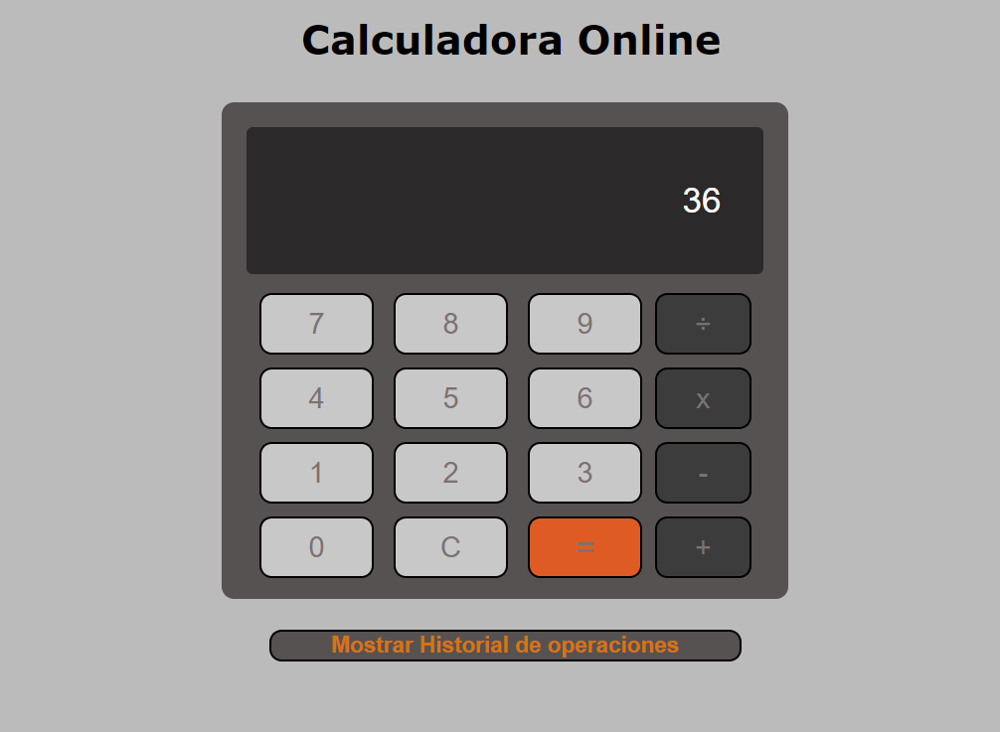
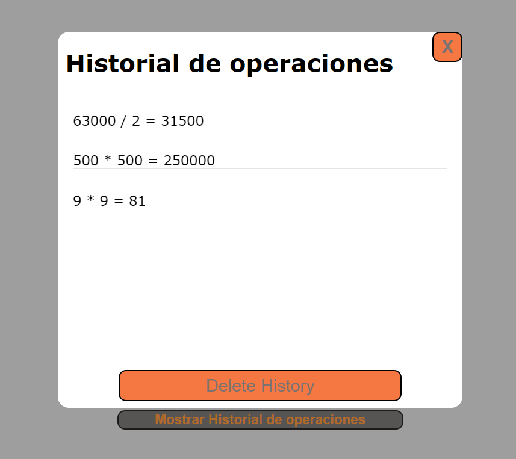
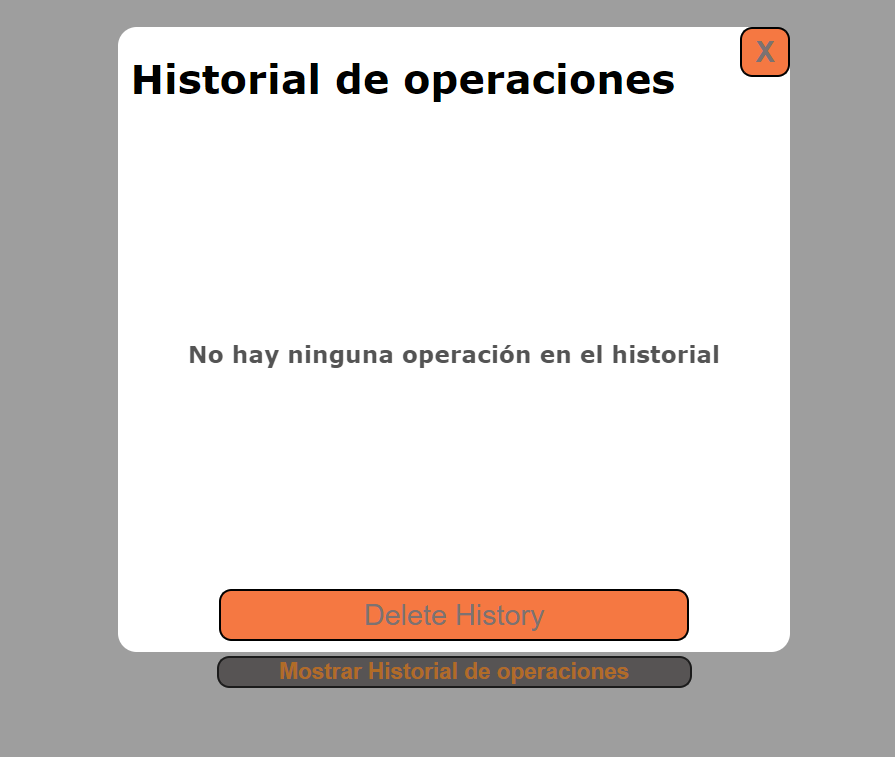

# Tarea 2 programacion Web

Esta es mi tarea 2 de programación web

- Yangel Garcia Severino
- Mi matrícula es : 2022-0827

## Título de la tarea

Crea una calculadora con HTML5 y JavaScript (ES5) adornada con CSS3 que pueda realizar las operaciones básicas de suma, resta, multiplicación y división. La calculadora debe tener una funcionalidad de historial de operaciones para que los usuarios puedan revisar sus cálculos previos en cualquier momento. Utiliza localStorage para guardar el historial de las operaciones realizadas, permitiendo que los usuarios puedan eliminarlos cuando deseen.

## Capturas de pantalla

